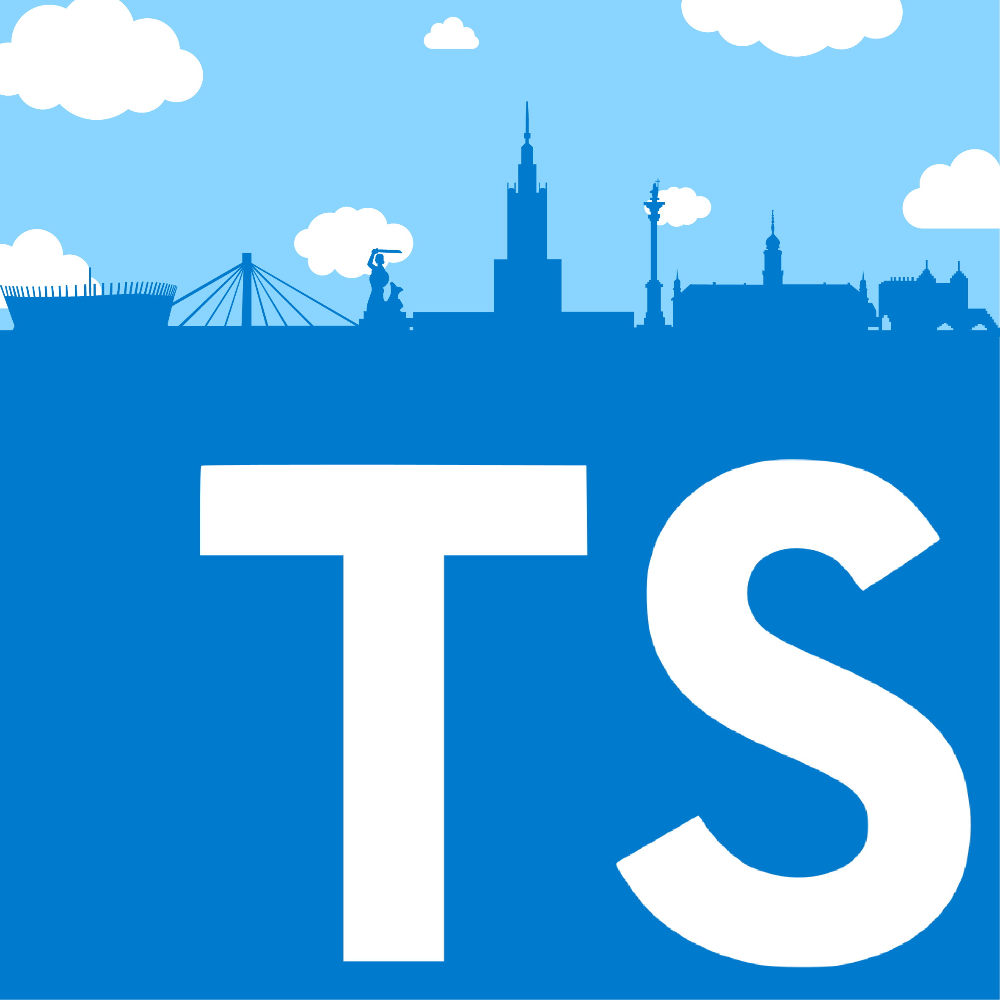

  
  <h3 align="center">Warsaw TypeScript Meetup</h3>
  

    <a href="https://www.meetup.com/Warsaw-TypeScript">Meetup</a> | <a href="https://twitter.com/wwatypescript">Twitter</a>
  

## What's here

This repo exists in order to bring transparency to our processes. Visit [issues](https://github.com/krzkaczor/Warsaw-TS-meetup/issues?q=is%3Aissue+is%3Aopen+sort%3Aupdated-desc) for more.